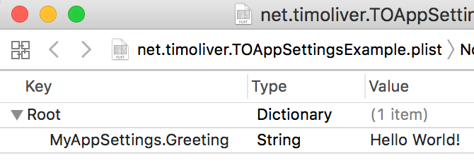

# TOAppSettings

[](https://github.com/TimOliver/TOAppSettings/actions?query=workflow%3ACI)
[](http://cocoadocs.org/docsets/TOAppSettings)
[](https://raw.githubusercontent.com/TimOliver/TOAppSettings/master/LICENSE)
[](http://cocoadocs.org/docsets/TOAppSettings)

A Realm-like object wrapper class for `NSUserDefaults`.

```swift

// Define a subclass with a list of properties
class MyAppSettings: AppSettings {
    @objc dynamic var greeting = ""
}

// Automatically save to `NSUserDefaults`!
let settings = MyAppSettings.default()
settings.greeting = "Hello World!"

```



`NSUserDefaults` has been a staple component of iOS development ever since iPhoneOS 2.0. As convenient as the API is for persisting data, it's a rather finicky API to work with. Aside from the methods for reading and writing data being overly verbose, keeping track of the key names can also be tricky.

`TOAppSettings` is a wrapper class designed to make working with `NSUserDefaults` significantly easier. It uses similar mechanisms to the [Realm](http://realm.io) iOS database in that it uses the Objective-C runtime to dynamically map its properties directly to the equivalent `NSUserDefaults` methods.

## Features
* Automatically maps object properties to `NSUSerDefaults`.
* Supports all of the data types originally supported by `NSUserDefaults`.
* Automatically generates unique key names, so there is no risk of collisions with other persisted data.
* An identifier string can be used to save multiple, different copies of the same object.
* Provides support for sharing preferences between apps in the same developer container.
* Additionally, supports all objects that conform to `NSCoding` and automatically handles serialising them to and from disk.
* Instances of `TOAppSettings` are internally cached, so there is little overhead making subsequent instantiation calls.
* Thread-safe, just like `NSUserDefaults` itself is.
* Written in Objective-C, but has a very Swifty interface too.
* Unit-tested (With more on the way!)

## Installation

### Manual Installation
Drag `TOAppSettings.h` and `TOAppSettings.m` into your Xcode project.

### CocoaPods
```
pod 'TOAppSettings'
```

### Carthage
Please file a PR. :)

## Credits
`TOAppSettings` was originally created by [Tim Oliver](http://twitter.com/TimOliverAU) as a component for [iComics](http://icomics.co), a comic reader app for iOS.


## License
TOCropViewController is licensed under the MIT License, please see the [LICENSE](LICENSE) file. 
